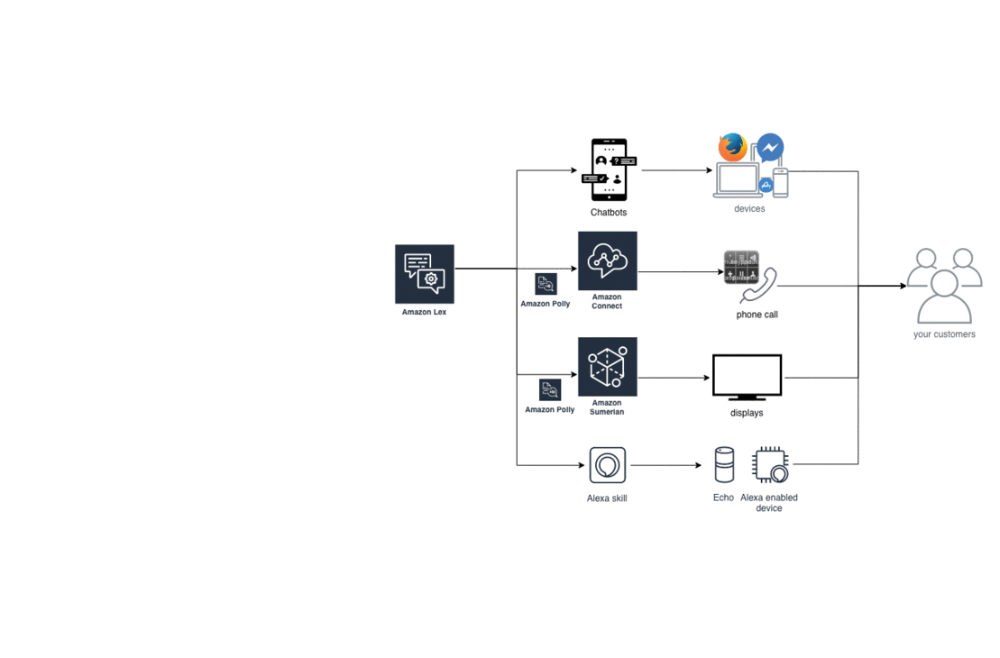

# Cross-Interfaces-Intelligent-Customer-Engagement

This describes the Cross-Interfaces-Intelligent-Customer-Engagement.  
**1. why this is important.**  
**2. how to achieve it - a sample technical architecture diagram using AWS services.** (there can be various ways of architecting this depending on the requirements. For example, it can be Lex-centered, Amazon Connect-centered. In this example, it is Pinpoint-centered.)  
**3. what it looks like** - a demo  
**4. how to build it** - a lab 

## 1. why this is important ##
IT has been a cost center traditionally in enterprise customers. Enterprises are transforming, but not yet making IT a powerful tool - an business enabler, a revenue generator. Digital-born companies like Uber, Airbnb, Grab are examples of using IT to enable businesses. Traditional enterprises' IT departments are cost center and they need to reduct cost. If cloud companies like AWS, Google, or MS keep engaging the IT departments, it’s definitely a price war. However, some other departments like marketing, advertising, communication are revenue center and they keep engaging with the consumers and need to keep thinking how to better serve the consumers to generate more revenue. If cloud companies play a role here, i.e., enabling enterprises to better serve their consumers to achieve revenue growth, it going to be mutual benefits for both enterprises and cloud companies.

(Today, dealing with traditional IT cost center seems a bigger opportunity to giant cloud firms because migrations like VMC, SAP costs a lot. The latter gets lesser attention because it doesn’t actually bring in much monetary value. Enterprises is big. Who is cloud companies' real end customers within enterprises, and whom should the cloud companies spend the most of the time with? How cloud companies jump out of cloud services (cheaper, scalable, reliable infra, it’s still important) and become the critical business enabler? What should cloud companies do today to make sure 5 years later, or even after enterprises are transformed, cloud is still important to enteprise customer’s success?

The one never-changing equation in any business is increasing revenue and reducing cost, and the rest is profit. Use IT to empower business to gain more revenue versus use IT to reduce IT cost? Which one is more long term? I leave it to everyone to comment.) 

## 2. how to achieve it ## 
Cross interface customer engagment, aka, cognitive experiences, or omni-channels are NOT new. Enterprises have been doing it for a long time. There are thousands of available products in the market. AWS isn't the market leader by far. However, AWS has its unique standpoint - the breadth and depth of AWS allow customers to achieve a real-time intelligent customer interaction on different channels seamlessly and easily, without worrying about the undifferentiated heavy lifing integration underneath the application. I have many real life stories. One of customers have wonderful digital channels to engage with their end users. They have their chatbot on IBM, Voice skill on Google Home, and telephony with Genesys.

In such cases, AWS needs to present the competency and eco-system of voice, text, chatbot, telephony, Sumerian, analytics, AI, Personalize, all on AWS platform. For example, I saw customers says . It takes efforts to integrate all these aspects. So, if they are all on AWS, it reduces the integration efforts and can achieve higher business insights.

Watch out this space for updates!

## Appendix ##

Opinions shared here are on my own. The reason of this thought is that I want to use this to calibrate myself when I meet my customers, evaluate whether I spend the right amount of time with the right customers.

•	Personalized Omni Channel Strategy and Amazon Connect. Couple of enterprise customers in Singapore are looking at Omni-channel solution. One example is OCBC. Omni channel generally refers to one central information or management platform and with support to multiple user engagement channels, e.g., text, voice. In AWS, the information collected from different channels can feedback to our analytics engine to personalize the consumer engagement. In some Amazon Connect discussions, I noticed that customers are reducing telephony budget and trying to direct the call volume to digital, such as chat. If this has becoming a budgeting situation, AWS might not standout in the pricing and sole Amazon Connect competition. In such cases, AWS needs to present the competency and eco-system of voice, text, chatbot, telephony, Sumerian, analytics, AI, Personalize, all on AWS platform. For example, I saw customers says their chatbot is on IBM, Voice is on Google, and telephony is with some other platform. It takes efforts to integrate all these aspects. So, if they are all on AWS, it reduces the integration efforts and can achieve higher business insights.

