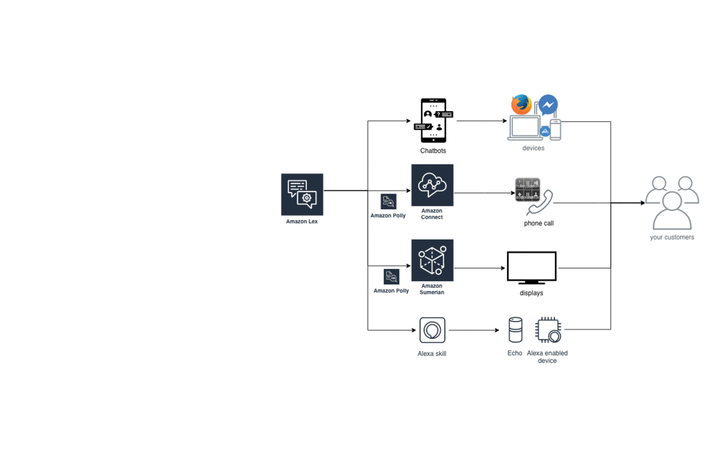

# Cross Interfaces Intelligent Customer Engagement

This describes the Cross-Interfaces-Intelligent-Customer-Engagement.  
**1. Why This is Important.**  
**2. How to Architect it - a sample technical architecture diagram using AWS services.** (there can be various ways of architecting this depending on the requirements. For example, it can be Lex-centered, Amazon Connect-centered. In this example, it is Pinpoint-centered.)  
**3. How to Build it** - a lab  
**4. What it Looks Like** - a demo 
**5. FAQ** 

## 1. Why This is Important ##
IT has been a cost center traditionally in enterprise customers. Enterprises are transforming, but not yet making IT a powerful tool - an business enabler, a revenue generator. Digital-born companies like Uber, Airbnb, Grab are examples of using IT to enable businesses. Traditional enterprises' IT departments are cost center and they need to reduct cost. If cloud companies like AWS, Google, or MS keep engaging the IT departments, it’s definitely a price war. However, some other departments like marketing, advertising, communication are revenue center and they keep engaging with the consumers and need to keep thinking how to better serve the consumers to generate more revenue. If cloud companies play a role here, i.e., enabling enterprises to better serve their consumers to achieve revenue growth, it going to be mutual benefits for both enterprises and cloud companies.

(Today, dealing with traditional IT cost center seems a bigger opportunity to giant cloud firms because migrations like VMC, SAP costs a lot. The latter gets lesser attention because it doesn’t actually bring in much monetary value. Enterprises is big. Who is cloud companies' real end customers within enterprises, and whom should the cloud companies spend the most of the time with? How cloud companies jump out of cloud services (cheaper, scalable, reliable infra, it’s still important) and become the critical business enabler? What should cloud companies do today to make sure 5 years later, or even after enterprises are transformed, cloud is still important to enteprise customer’s success?

The one never-changing equation in any business is increasing revenue and reducing cost, and the rest is profit. Use IT to empower business to gain more revenue versus use IT to reduce IT cost? Which one is more long term? I leave it to everyone to comment.) 

## 2. How to Architect it ## 
Cross interface customer engagment, aka, cognitive experiences, or omni-channels are NOT new. Enterprises have been doing it for a long time. There are thousands of available products in the market. AWS isn't the market leader by far. However, AWS has its unique standpoint - the breadth and depth of AWS allow customers to achieve a real-time intelligent customer interaction on different channels seamlessly and easily, without worrying about the undifferentiated heavy lifing integration effort of different channels. I have many real life stories. One of customers have wonderful digital channels to engage their consumers. They have their chatbot on IBM, voice skill on Google Home, and telephony with Genesys. Each channel was well implemented and works well on their own. However, they were struggling with having the three channels integrated in order to get a full picture of the entire customer experience. Even external system integrators also face the challenge to integrate the three different platforms. 

In such cases, AWS has the competency and eco-system of voice, text, chatbot, telephony, Sumerian, analytics, AI, Personalize, all on AWS platform. It reduces the integration efforts and gain customers insight more efficiently and quickly. 

There are various ways of architecting this depending on the requirements. For example, it can be Lex-centered, Amazon Connect-centered. In this example, it is Pinpoint-centered.

## 3. How to Build it ## 
The lab is Lex-centered to demonstrate omni-channel.  

Hands-on Lab Level 300~400 - **Build the new omni-channel in the fastest way using AWS: How to build ONE chatbot and use it on SIX channels? Web, Telephony (Amazon Connect), Facebook, Alexa, Mobile Apps, Virtual Avatar (Amazon Sumerian)**  
This Lab will cover AWS Lambda, Amazon Lex, Amazon Connect, Alexa Skill Kit, AWS Mobile Services,  Sumerian.

*Draft only. The lab is modular and do not need to cover all channels if not required. If Amazon Connect is the focus, there can be more content on Amazon Connect, Data Dipping, Lambda, Lex, and no need to cover Web, Alexa, etc.*

**Prequisites:**
1. **AWS global region Account.** Please open an AWS account. You need a valid credit card to set up your account.
2. **Amazon developer account.** Go visit Amazon Developer Portal to create an account for free.
3. **Alexa APP.** Please download Alexa APP using App Store or Google Play.

**Detailed breakdown:**
| AWS Services  | Features      | Remarks|
|:------------- |:--------------|:------|
| Amazon Lambda| Serverless, Lambda Triggers, Cloudwatch Monitoring |  refer https://alexaworkshop.com/custom-skill/ (content created in 2018) as an example, content to be updated with more features  |
| Amazon Lex  | Integration with social media channels, such as Facebook, Integration with Web UI, Use Error Handling, Fallback Handing, Synonym, Custom Slots to Increase Accuracy, Conversation History, Logging, Natural Language Understanding v.s. Cards  | refer https://alexaworkshop.com/custom-skill/ (content created in 2018) as an example, content to be updated with more features |
| AWS Connect | Setup Connect Instance, Claim Number, Create Callflow, Integration with Chatbot on Lex, Call Recording, Sentiments Analysis, Credit Card Masking, etc.    | To contact Amazon Connect Specialist team for more detailed content to be included   |
| Alexa Skill Kit | Use of Lex Chatbot to create Alexa Skill, Design and Development of Alexa Skill, Design Principles of Voice Skills, Operational Best Practices - text vs voice, Monitoring Dashboard, etc. | This content is flexible, can be shorten or lengthen depending on time. refer https://alexaworkshop.com/custom-skill/ (content created in 2018) as an example, content to be updated with more features  |
| AWS Mobile | Create a simple app, Integration with Chatbot    | This content is flexible, can be shorten or lengthen depending on time   |
| AWS Sumerian | Create a scene, Integration with Lex Chatbot    | This content is flexible, can be shorten or lengthen depending on time   |

## 4. What it Looks Like ##
With the completion of the lab in section 3, audience is able to create a dialogue model in Lex and use it on Alexa (hands-free), Telephone call (agentless), Mobile, Web, and multiple Social Media platform. 
 
If the allocated time for this session is less than 1 hour, a brief video demo will be created to show audience how to build it and what it looks like. 

## 5. FAQ ##
1. **Data Masking.** 
to be added
2. **Data Encription.** 
to be added
3. **Roles and teams.** 
to be added

## Variations ##
The lab can be modified to **Amazon Connect centric** (with both chat and call available for agents and callers, and real time sentiments analysis), **Pinpoint and Personalize centric** (with integration of SMS, Notification, Emails as the traditional customer channel and unify all channels for personalization) , etc.  

## Appendix ##

Opinions shared here are on my own. The reason of this thought is that I want to use this to calibrate myself when I meet my customers, evaluate whether I spend the right amount of time with the right customers.

Personalized Omni Channel Strategy and Amazon Connect. Couple of enterprise customers in Singapore are looking at Omni-channel solution. Omni channel generally refers to one central information or management platform and with support to multiple user engagement channels, e.g., text, voice. In AWS, the information collected from different channels can feedback to our analytics engine to personalize the consumer engagement. In some Amazon Connect discussions, I noticed that customers are reducing telephony budget and trying to direct the call volume to digital, such as chat. If this has becoming a budgeting situation, AWS might not standout in the pricing and sole Amazon Connect competition. In such cases, AWS needs to present the competency and eco-system of voice, text, chatbot, telephony, Sumerian, analytics, AI, Personalize, all on AWS platform. For example, I saw customers says their chatbot is on IBM, Voice is on Google, and telephony is with some other platform. It takes efforts to integrate all these aspects. So, if they are all on AWS, it reduces the integration efforts and can achieve higher business insights.

