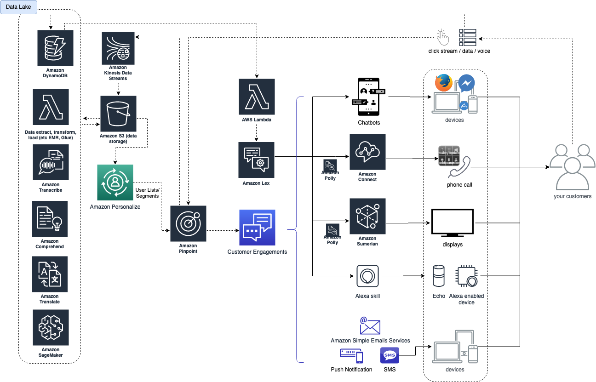

# Cross-Interfaces-Intelligent-Customer-Engagement

This describes the Cross-Interfaces-Intelligent-Customer-Engagement. There is a technical architecture diagram (to be finished) in Amazon Web Services context. There is also a demo on Voice, Web (Mobile App) interaction (to be finished).

IT has been a cost center in enterprise customers. Enterprises are transforming but not yet making IT to the next powerful level - an business enabler (like Uber, Airbnb) . Traditional Head of Department of IT's job is to reduce cost. If cloud companies enter here, it’s a price war. On the other hands, some departments like marketing, customer facing departments, RMs, etc, generate revenue for enterprises. If cloud companies play a role here to use IT to enable them, it’s a growing - mutual success for both enterprises and cloud companies. Today, the former seems a bigger opportunity to giant cloud firms because migrations like VMC, SAP costs a lot. The latter gets lesser attention because it doesn’t actually bring in much monetary revenue. Enterprises is big. Who is cloud companies' real end customers within enterprises, and whom should the cloud companies spend the most of the time with? How cloud companies jump out of cloud services (cheaper, scalable, reliable infra, it’s still important) and become the critical business enabler? What should cloud companies do today to make sure 5 years later, or even after enterprises are transformed, cloud is still important to enteprise customer’s success?

The one never-changing equation in any business is increasing revenue and reducing cost, and the rest is profit. Use IT to empower business to gain more revenue versus use IT to reduce IT cost? Which one is more long term? I leave it to everyone to comment.

Opinions shared here are on my own. The reason of this thought is that I want to use this to calibrate myself when I meet my customers, evaluate whether I spend the right amount of time with the right customers.

Watch out this space for updates!

